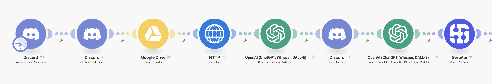
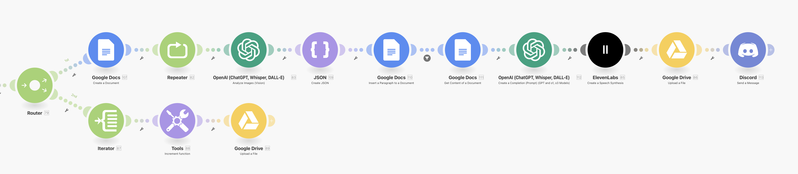

### AI Movie Describer Agent Technical Documentation

**"Try it out" Link:** https://discord.gg/D4QHrrMTh9
- Speack is "requests" channel. Just simply speak, no more **"@"** or **"/"** command.
- Get the result in "result" channel.

**"How to use blueprint.json"**
- Download JSON file.
- Open Make.com.
- Create a "new scenario"
- Import your download JSON.
  
**Version: 1.0**  
**Last Updated: February 23, 2025**

---

## Table of Contents

1. **Project Overview**
2. **Current Implementation (Phase 1)**
   - 2.1 System Architecture
   - 2.2 Core Modules and Tech Stack
   - 2.3 Workflow and Implementation Details
   - 2.4 Test Results and Limitations
3. **Future Development Plan (Phase 2+)**
   - 3.1 Real-time Image Processing Optimization
   - 3.2 Hardware Integration and Wearable Devices
   - 3.3 Multimodal Input and Collaboration Features
4. **Vision and Scalability**

---

## 1. Project Overview

**Goal**: Provide a real-time, high-accuracy audio description service for visually impaired viewers by using AI to replace traditional human movie describers. Target a ≥86% synchronization rate between audio and video while extending to real-time environment perception scenarios.  
**Core Value**:

- **Accessibility**: Reduce manual costs through automation, increasing service availability.
- **Low Latency**: Keep end-to-end processing within 1.2× the total video playback time.
- **Scalability**: A flexible architecture designed for future hardware integration and multimodal inputs.

---

## 2. Current Implementation (Phase 1)

### 2.1 System Architecture

- **Front End**: Discord voice interface (supports multiple languages).
  
- **Middleware**: Make.com automation workflow engine.
  
- **Back End**: Google Drive (storage), Google Sheets (structured data), OpenAI API (image analysis and text generation), ElevenLabs (TTS).
  

### 2.2 Core Modules and Tech Stack

| **Module**                     | **Implementation**         | **Key Parameters**                                       |
| ------------------------------ | -------------------------- | -------------------------------------------------------- |
| **Video Search & Capture**     | YouTube Data API + FFmpeg  | Capture interval: 2s/frame, resolution: 720p             |
| **Image Analysis**             | OpenAI GPT-4o              | 5 images/group, context window: 1024 tokens              |
| **Text Alignment & Polishing** | OpenAI GPT-o3 mini         | Max length: 400 characters/segment                       |
| **Speech Synthesis**           | ElevenLabs Multilingual v2 | Voice style: neutral narration, speed: 140–180 WPM       |
| **Data Storage**               | Google Drive + Sheets      | Structured fields: timestamps, text segments, audio URLs |

### 2.3 Workflow and Implementation Details

#### Step 1: User Input & Video Processing

1. The user issues a voice command in Discord (e.g., “Play ‘Avatar’ from minute 30 to minute 40”).
2. The Make.com workflow calls the YouTube Data API, FFMPEG captures screenshots every 2 seconds, and stores them in Google Drive (naming convention: `<videoID>_<timestamp>.png`).

#### Step 2: Scene Analysis & Text Generation

1. Every 5 screenshots (covering 10 seconds of video) are sent to GPT-4o to generate a movie-style descriptive text snippet, for example:
   > “The main character, dressed in blue armor, stands at the edge of floating mountains with a glowing forest in the background. The camera slowly pulls back, revealing a deep chasm below.”
2. These snippets are appended to Google Sheets in chronological order, including fields like `start_time`, `end_time`, `raw_text`, and `status`.

#### Step 3: Global Alignment & Speech Generation

1. GPT-o3 mini aligns adjacent text snippets, fixing abrupt splits (e.g., merging “Character turns around” and “Door closes” into a continuous action).
2. ElevenLabs produces audio clips, each carefully timed to 10 seconds (±0.5s), which are stored in Google Drive and returned to Discord for playback.

### 2.4 Test Results and Limitations

| **Metric**          | **Current Performance**               | **Optimization Focus**                                    |
| ------------------- | ------------------------------------- | --------------------------------------------------------- |
| Audio-Video Sync    | 86%                                   | Dynamically adjust TTS speed algorithm                    |
| End-to-End Latency  | 1.5× playback time                    | Parallel image processing pipeline                        |
| Scene Continuity    | 92% accuracy                          | Introduce a video action prediction model                 |
| **Main Limitation** | Relies on third-party API rate limits | Deploy real-time models (e.g., GPT 4o / 4o mini realtime) |

---

## 3. Future Development Plan (Phase 2+)

### 3.1 Real-time Image Processing Optimization (Q1–Q2 2025)

- **Dynamic Frame Rate Adjustment**: Automatically modulate capture intervals (1–4s) based on scene complexity.
- **AI Alignment Module**:
  - Train specialized contrastive learning models to detect semantic discrepancies between narration and video (target: Δ<0.5s).
  - Hardware requirement: NVIDIA Jetson Orin (64GB memory with INT8 optimization).

### 3.2 Hardware Integration & Smart Glasses (Q3–Q4 2025)

| **Component** | **Specification**                        | **Function**                                   |
| ------------- | ---------------------------------------- | ---------------------------------------------- |
| Camera Module | Sony IMX678 (low-light enhanced)         | Real-time environment capture (120° FOV)       |
| Audio Output  | Bone-conduction speakers (leakage-proof) | Privacy-friendly, suitable for outdoor use     |
| Local AI Chip | Qualcomm Snapdragon 8 Gen3 AI Engine     | Offline lightweight GPT-4 (4-bit quantization) |

### 3.3 Collaboration Features & Extensions (2026+)

- **Multi-user Collaborative Annotation**: Crowdsourced refinement of AI-generated descriptions, building a high-quality dataset.
- **Emergency Detection**: Vision agent identifies hazardous scenes (e.g., fire, falls) and triggers alerts.

---

## 4. Vision and Scalability

**Ultimate Goal**: Develop a universal perception enhancement system for visually impaired individuals, covering scenarios:

- **Entertainment**: Real-time audio narration for movies, games, and theater.
- **Navigation**: AR-based route guidance (≥99% obstacle detection accuracy).
- **Social Interaction**: Face recognition and emotion analysis (“Your friend is 3 meters to the left, smiling”).

**Technical Roadmap**:  

---

**Appendix**:

- Data Privacy and Compliance (GDPR and HIPAA)
- Third-party API Usage Cost Analysis
- Open-source Repository (Pending Release)

---
